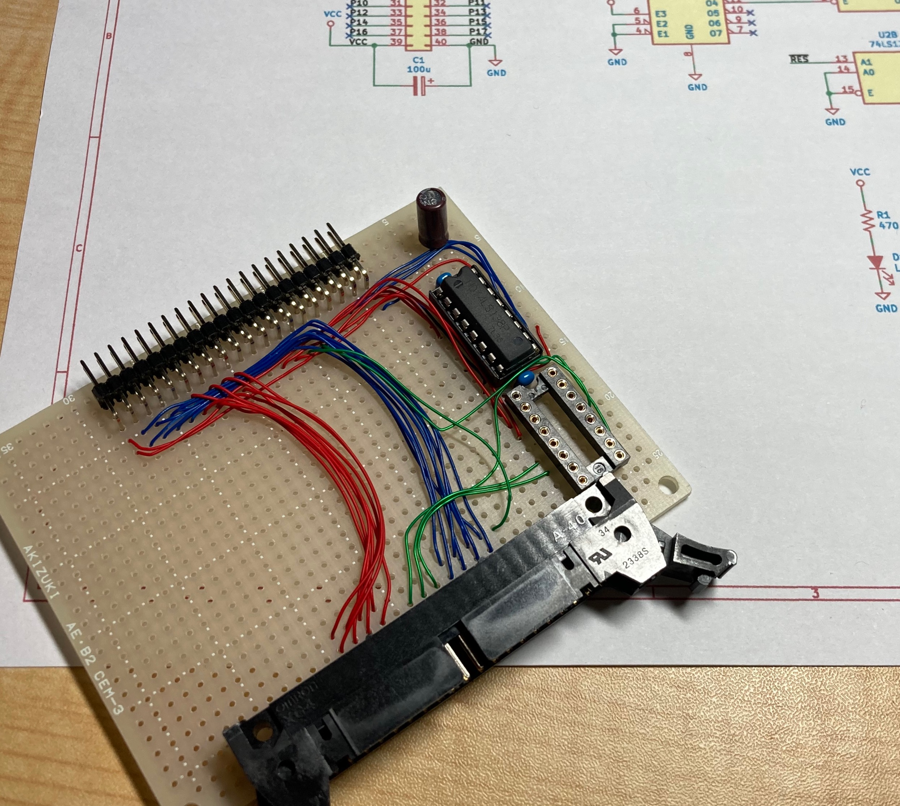
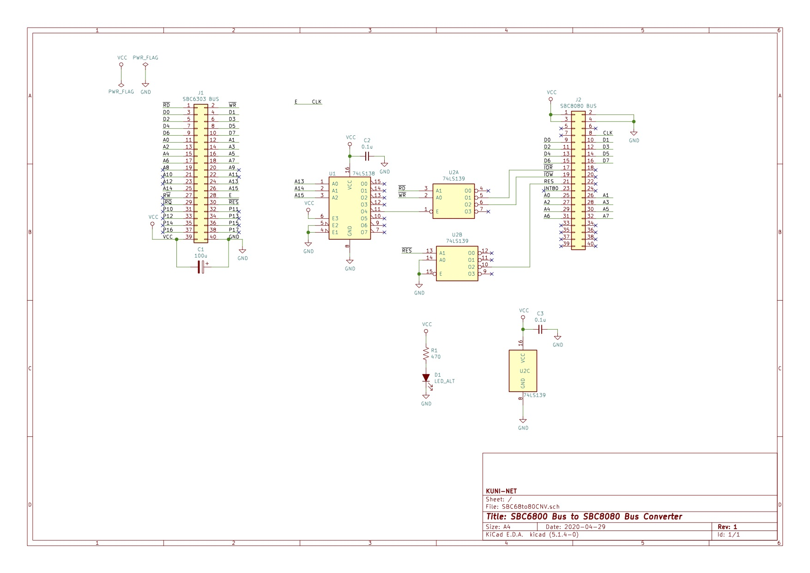

= SBC68系バス(SBC6303 or SBC6800Adapter)からSBC8080系バスへの変換ボード

== 概要
* SBC6303ルーズキットや、SBC6800 Adapterの装備しているSBC68系系バス(40pin MIL)から、SBC8080ルーズキット、KZ80シリーズが装備しているSBC80系バスへの変換ホードです。
** 注意
*** 全部の信号線を結線しているわけではありません。
*** 8255などのタイミングの相違で動かない石もあります。

== プログラムサンプル
* exsample/6502/YM2151ディレクトリ
** SBC68系バスへ、SBC68系バスを装備した6502CPUマイコンと、KZ80-YM2151 FM音源ボードをつなげて演奏するサンプル。
** 6502マイコン
*** https://github.com/kuninet/K65-SBC

== 参考
* SBC6303ルーズキット
** https://vintagechips.wordpress.com/2017/12/05/sbc6800%E3%83%AB%E3%83%BC%E3%82%BA%E3%82%AD%E3%83%83%E3%83%88/
* SBC8080ルーズキット
** https://vintagechips.wordpress.com/2018/06/24/sbc8080-cpu%E3%83%AB%E3%83%BC%E3%82%BA%E3%82%AD%E3%83%83%E3%83%88/
* SBC6800 Adapter
** https://sbc738827564.wordpress.com/2018/08/11/sbc6800adapter-rev02/
* SBC6809 Adapter
** https://sbc738827564.wordpress.com/2018/08/11/sbc6809adapter-rev02/